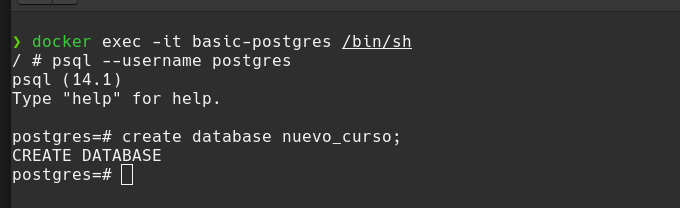
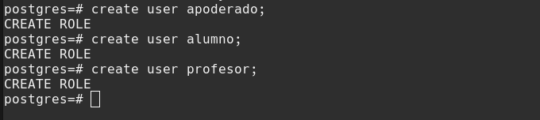
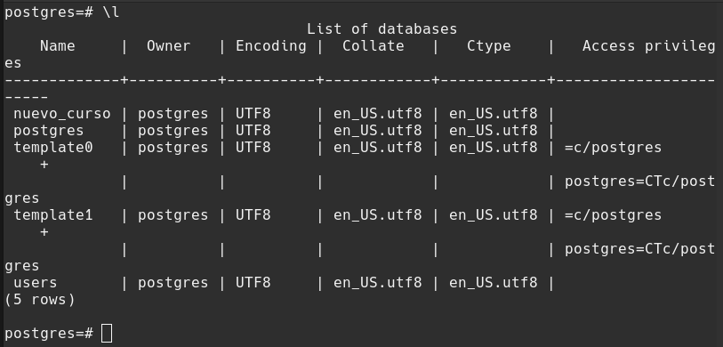
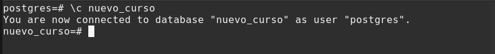

# PSQL

INSTRUCCIONES

- Crear una base de datos desde el Shell de PostgreSQL, llamada nuevo_curso. 

- Crear 3 usuarios desde el Shell de PostgreSQL.

- Listar la nueva base de datos creada desde el Shell de postgreSQL.

- Ingresar a la base de datos desde el Shell de postgreSQL.

